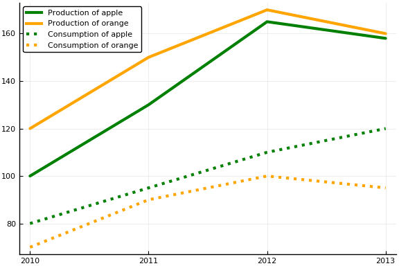

# Plotting

Plotting in julia can be obtained using a specific plotting package \(e.g. [Gadfly](https://github.com/dcjones/Gadfly.jl), [Winston](https://github.com/nolta/Winston.jl)\) or, as I prefer, use the [Plots](https://github.com/JuliaPlots/Plots.jl) package that provide a unified API to several supported backends

Backends are chosen running `chosenbackend()` \(that is, the name of the corresponding backend package, but written all in lower case\) before calling the `plot` function. You need to install at least one backend before being able to use the `Plots` package. My preferred one is [PlotlyJS](https://github.com/sglyon/PlotlyJS.jl) \(a julia interface to the [plotly.js](https://plot.ly) visualization library. \), but you may be interested also in [PyPlot](https://github.com/JuliaPy/PyPlot.jl) \(that use the excellent python [matplotlib](http://matplotlib.org/api/pyplot_api.html) **VERSION 2**\).

For example:

```text
Pkg.add("Plots")
Pkg.add("PyPlot.jl") # or  Pkg.add("PlotlyJS")
using Plots
pyplot()             # or plotlyjs()
plot(sin, -2pi, pi, label="sine function")
```


**Temporary note: as of writing, the** `plotlyjs` **backend doesn't work.** `pyplot` **backend works, but require the user to manually add the** `PyCall` **and** `LaTeXStrings` **packages.**

Attention not to mix using different plotting packages \(e.g.`Plots` and one of its backends\). I had troubles with that. If you have already imported a plot package and you want to use an other package, always restart the julia kernel \(this is not necessary, and it is one of the advantage, when switching between different bakends of the `Plots` package\).

You can find some useful documentation on `Plots` backends:

* [Which backend to choose ?](http://docs.juliaplots.org/latest/backends/)
* [Charts and attributes supported by the various backends](http://docs.juliaplots.org/latest/supported/)

### Plotting multiple groups of series from a DataFrame

The following example uses [StatPlots](https://github.com/JuliaPlots/StatPlots.jl) in order to work directly on DataFrames \(rather than on arrays\). Passing the dataFrame as first argument of the `@df` macro, you can access its columns by name and split the overall series using a third column.

```text
using DataFrames, Plots, StatPlots
df = DataFrame(
  fruit       = ["orange","orange","orange","orange","apple","apple","apple","apple"],
  year        = [2010,2011,2012,2013,2010,2011,2012,2013],
  production  = [120,150,170,160,100,130,165,158],
  consumption = [70,90,100,95,   80,95,110,120]
)
pyplot()
mycolours = [:green :orange] # note that the serie is piled up alphabetically
fruits_plot = @df df plot(:year, :production, group=:fruit, linestyle = :solid, linewidth=3, label= reshape(string.("Production of ", sort(unique(:fruit))),(1,:)), color=mycolours)
@df df plot!(:year, :consumption, group=:fruit, linestyle = :dot, linewidth=3, label ="Consumption of " .* reshape(sort(unique(:fruit)),(1,:)), color=mycolours)
```



The first call to `plot()` create a new plot. Calling `plot!()` modify instead the plot that is passed as first argument \(if none, the latest plot is modified\)

## Printing area charts

Use the `fill(fillrange,fillalpha,fillcolor)` attribute, e.g. `fill = (0, 0.5, :blue)`.

## Saving

To save the figure just call one of the following:

```text
savefig("fruits_plot.svg")
savefig("fruits_plot.pdf")
savefig("fruits_plot.png")
```

### A note on saving with the plotlyjs backend

**Julia 1.0 note**: As `plotlyjs` still doesn't work on Julia 1.0, this subsection needs still to be checked!

Only for the `plotlyjs` backend, you need to first install the `Rsvg` package \(`Pkg.add("Rsvg")`\) \(or rely to the saving button on the widget\). Still there will be some problems:

* svg: an html file with embedded svg is actually created, not a svg file
* pdf: this currently doesn't work in Julia 0.6
* png: this works

